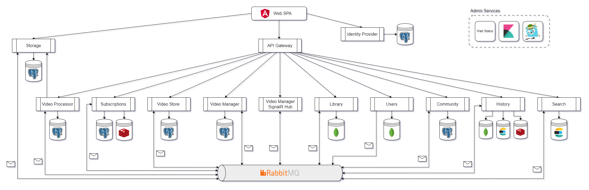

# Video Sharing Platform - YouTube Clone

This repository contains a YouTube Clone microservices application built with .NET 7 and Angular 14.

> This project is still in progress and subject to changes and refactoring.


### Table of Contents

**[Microservices Application (.NET)](#microservices-application-net)**<br>
**[SPA Application (Angular)](#spa-application-angular)**<br>
**[Screenshots](#screenshots)**<br>
**[Demo Video](#demo-video)**<br>
**[Running with Docker](#running-with-docker)**<br>
**[Kubernetes](#kubernetes)**<br>

### Architecture



### Overview of Technologies Used

- ASP.NET Core 7
- DDD/CQRS pattern
- Entity Framework Core
- MongoDB
- Elasticsearch
- RabbitMQ
- Event bus
- Transactional outbox pattern
- Distributed transaction
- Redis
- Distributed caching
- SignalR
- Duende identity server
- OAuth 2.0 with OpenID Connect
- FFmpeg for video processing
- Optimistic and pessimistic concurrency controls
- Data replication across services for higher availability, scalability, performance
- YARP reverse proxy
- Distributed logging using Serilog and ELK stack (ElasticSearch, Logstash and Kibana)
- Distributed tracing using OpenTelemetry and Jaeger
- Health checks
- Fault resilience
- JWT token
- Prometheus
- Docker
- Kubernetes
- Kustomize
- Terraform
- Azure Pipelines
- Angular 14

### Features

- Asynchronous processing to generate preview thumbnails and different resolutions of the uploaded videos
- Video upload and management
- Video playlist creation and management
- Video playback
- Video commenting and rating
- Video and playlist visibility (public, unlisted, private)
- Video tagging
- Video recommendations and suggestions
- Search and discovery of videos
- User authentication and authorization
- External login (Google)
- User profile, channel and subscription
- User channel customization (layout, thumbnail, banner)
- User watch history
- Notification message from subscribed targets
- Subscription feeds
- And more

## Microservices Application (.NET)

The microservices architecture of the application is based on ASP.NET Core 7, providing a scalable and flexible solution. Each microservice is designed to be horizontally scalable, allowing for granular resource allocation and efficient use of computing resources.

### Building Blocks

- Domain-driven design pattern helps to clarify complex domains and ensure the consistency of the business rules.

- Event bus based on RabbitMQ allows asynchronous communications between different services.

- Transactional outbox implemented for both Entity Framework Core and MongoDB persistence layers to ensure reliable and ordered message publishing.

- Integration events are requeued for transient errors and sent to dead-letter queue for unrecoverable errors.

- Routing slip pattern (as used in event bus system like MassTransit) allows eventual consistency in distributed transactions.

- Unit of work pattern implementation for committing changes in a single transactional batch for both Entity Framework Core and MongoDB

### Video Manager Service

The Video Manager Service plays a crucial role in the video sharing platform, managing the videos and their metadata.

- Video creation: The Video Manager Service handles the user request to create a new video.

- Video upload authorization: The Video Manager Service generates upload tokens that authorizes the users to upload video files.

- Video registration: After the video file is uploaded, the Video Manager Service registers the video with other microservices, including the Video Store, Library, Community, and History Services.

- Video processing initiation: Once the video is registered to different services, the Video Manager Service publishes an integration event to the Video Processor Service to initiate the video processing.

- Video processing completion notification: After the video is processed, the Video Manager Service publishes integration events to notify other microservices about the completion of the processing.

- Video metadata management: The Video Manager Service manages and store the original metadata of the videos, such as video title, description, visibility, tags, etc. The updated metadata is synchronized to the Video Store Service for serving.

- Video deletion: The Video Manager Service also has the ability to delete a video in response to user requests.

### Video Manager SignalR Hub Service

The Video Manager SignalR Hub Service enhances the Video Manager Service by delivering real-time notifications to users regarding the processing status of the videos.

### Video Processor Service

The Video Processor Service is responsible for processing the video files. This service utilizes the power of FFmpeg for video processing and generates different resolutions and thumbnails of the uploaded video. For this service to run correctly, FFmpeg must be installed in advance, which will be done by the Dockerfile automatically.

- The Video Processor Service will process the video file, generate different resolutions and preview thumbnails of the uploaded video using FFmpeg.

- If the video processing is interrupted for transient issues, the video processing will be retried automatically.

- The video processor service can be automatically horizontally scaled by Kubernetes horizontal pod autoscaler. This is implemented through the use of custom metrics, including the number of concurrent processing tasks, which are exposed by each instance of the video processor service and gathered by Prometheus. By integrating with the Prometheus adapter, the Kubernetes hpa can scale out the video processor service in response to the usage.

### Video Store Service

The Video Store Service is responsible for storing and serving the video metadata to the users. This service controls the publication of videos and ensures that the video metadata is replicated with other microservices, such as the Library Service.

### Storage Service

The Storage Service is responsible for storing and serving the video and image files. Both the users and other services can upload files to the Storage Service. This service integrates with Entity Framework Core to store the metadata of the uploaded files.

- For user upload, the user must provide a upload token.

  - The upload token is a JWT generated by other services, like Video Manager Service, that proves the user are allowed to upload a file.
  - The upload token contains a set of claims like user id, video id, maximum size of uploaded file and etc.

- After an image is uploaded, another token is returned to the user.

  - The token returned is also a JWT containing the information of the uploaded file.
  - This token is used by other services, like Users Service, for claiming that the image file is in use, otherwise it will be cleaned up after a period of time.

- After a video is uploaded, the Storage Service will instead publish an integration event to notify the Video Manager Service for the processing, without returning a token to the user.

  - Different approaches for video and image storage are used because video files are typically much larger in size and require more processing.

- There is a background service to clean up file which is no longer in
  use.
- It is possible to implement the IAntiVirusScanner for virus scanning.

- It is possible to integrate this service to cloud-based storage solution like Azure Blob Storage.

### Identity Provider Service

The Identity Provider Service is a microservice that is responsible for user authentication and authorization. This service integrates with Duende Identity Server, which is a comprehensive solution for identity management and security.

- Authorization code flow for user authorization and authentication.

- Client credential flow for machine-to-machine authorization and authentication.

- This service can be completely replaced by cloud-based identity management solution like Auth0, Azure AD.

### Users Service

The Users Service is responsible for managing and storing the user profiles and channel data.

- User profile management: This service is responsible for creating, storing, and managing the user profiles, including the user's display name, handle, description email, thumbnail, etc. The user profile creation requires an asynchronous distributed transaction to register the user profile to other microservices to ensure that the all the services work correctly.

- User channel management: The Users Service will also manage the data of the user's channel, such as the channel layout, banner, etc.

### Subscriptions Service

The Subscriptions Service is responsible for managing user subscriptions and storing user notifications.

- Subscription management: The Subscriptions Service enables users to subscribe to their desired channels.

- Storing user notifications: When a subscribed channel is updated, such as the publishing of a new video, the Subscriptions Service will store the corresponding notification messages. These notification messages are kept in a Redis database.

### Library Service

The Library Service is responsible for managing playlists and serving both the playlists and basic video metadata to users, as well as enabling video voting functionality.

- Managing user playlists: The Library Service is responsible for managing the playlists of users, including liked playlist, watch later playlist, and custom playlist. The items in the watch later and custom playlists are re-orderable for greater user convenience.

- Video voting: The Library Service allows users to vote on videos by liking or disliking them. This is essentially accomplished by adding the video to the user's liked or disliked playlist, respectively.

### Community Service

The Community Service is responsible for providing a platform for users to engage in discussions.

- Video commenting: The Community Service enables users to add comments to videos, reply to other users' comments, edit and delete comments.

- Comment voting: In addition to commenting, users can also vote on comments, allowing the community to signal which comments are most useful, insightful, or entertaining.

### History Service

The History Service is responsible for managing and storing the user watch history, as well as counting the number of views for each video. The watch history records are efficiently stored in an Elasticsearch database, enabling search functionality and the ability to analyze users' favorite video tags.

- Views counting: The views are counted in in-memory Redis database and written into MongoDb periodically for optimization purpose.

### Search Service

The Search Service is integrated with Elasticsearch to deliver full-text search capabilities for videos. With its integration, users can find trending and relevant tags, search videos based on tags, creators, and full-text queries.

- Full-text search: The Search Service supports full-text search, allowing users to search for videos based on titles, creator names, keywords, etc.

- Tag-based search: Users can search for videos using tags, making it easier to find relevant videos.

- Creator-based search: Users can search for videos by creator ids, enabling functionality such as subscription feeds.

- Relevance scoring: The Search Service also incorporates relevance scoring based on metrics such as views count and likes count to recommend popular videos.

- Tags search: The Search Service uses Elasticsearch's bucket aggregation to find find trending tags and relevant tags.

### API Gateway Service

The API Gateway Service,integrated with YARP, provides a centralized entry point for all client requests and distributing them to the appropriate backend services, except for the Storage and Identity Provider Services. Additionally, it enables rate limiting functionality to protect the underlying backend services from excessive traffic.

### Web Status Service

The Web Status Service provides a web user interface for health checks. For automatic Kubernetes services discovery, please refer to [Health Checks UI automatic Kubernetes services discovery](https://github.com/Xabaril/AspNetCore.Diagnostics.HealthChecks/blob/master/doc/k8s-ui-discovery.md).

### Distributed Logging

The logs are sent to the ELK Stack (Elasticsearch, Logstash, and Kibana) by Serilog for storage, processing, and analysis. All the log data is collected and stored in a centralized Elasticsearch database, making it easy to search and analyze log data across all components of the system.

### Distributed Tracing

OpenTelemetry is used to instrument the microservices, generate tracing data, and export it to Jaeger to gain visibility into the performance and behavior of the application.

### Dependencies

- Autofac
- AutoMapper
- AspNetCore.Diagnostics.HealthChecks
- Duende.IdentityServer
- FluentValidation
- IdentityModel
- MediatR
- Microsoft.EntityFrameworkCore
- MongoDB.Driver
- NEST
- Newtonsoft.Json
- Npgsql.EntityFrameworkCore.PostgreSQL
- OpenTelemetry
- Polly
- RabbitMQ.Client
- Serilog
- SixLabors.ImageSharp
- Yarp.ReverseProxy

### Requirements

- FFmpeg

### Pending Improvement

- **AKS Virtual Nodes**: Support for AKS virtual nodes can be added to the video processor service, which allows it to run on the Azure container instances to enhance its scalability and efficiency.

- **Testing**: The application currently lacks unit and functional testing. Adding tests would help to catch bugs and ensure the application works as expected.

- **Caching**: More caching can be added to the application to improve its performance and reduce the load on the backend services.

## SPA Application (Angular)

The SPA (Single Page Application) is built using Angular, Angular Material, Ngrx, and Videogular. These technologies enable the creation of responsive user interfaces, providing a smooth user experience.

### Dependencies

- AppAuth
- Angular Material
- Color Thief
- Microsoft SignalR Client
- Moment.js
- NgRx
- Ngx Scrollbar
- Ngx Videogular
- Swiper

## Screenshots


[MORE SCREENSHOTS](./Screenshots.md)

## Demo Video

[](https://www.youtube.com/watch?v=-3ABN57sjqA "YouTube Clone Application Demo")

[YouTube Clone Application Demo Video](https://www.youtube.com/watch?v=-3ABN57sjqA)

## Running with Docker

To run the application and its necessary infrastructure, make sure that you have Docker and Docker Compose installed on your machine.

Navigate to the **Scripts** directory and use the following commands:

##### Windows

```
backend_build.bat
backend_up.bat

front_build.bat
front_up.bat
```

##### Linux

```
./backend_build.sh
./backend_up.sh

./front_build.sh
./front_up.sh
```

The scripts will launch 26 containers, including the web client, microservices and infrastructure.

After the application is completely launched, you should able to browse the different components by visiting

```
Web SPA : http://localhost:4200/
Web Status : http://localhost:16050/
Kibana : http://localhost:5601/
Jaeger UI : http://localhost:16686/
```

```
This application use the following ports:

    PostgreSQL: 5432
    Adminer: 8080
    PgAdmin: 8081
    RabbitMQ: 5672
    RabbitMQ Management: 15672
    MongoDB: 27017
    MongoExpress: 8082
    Elasticsearch: 9200
    Logstash: 9600, 9250
    Kibana: 5601
    Redis: 6379
    RedisCommander: 8083
    Jaeger: 5565/udp, 6831/udp, 6832/udp, 5778, 14268, 14250, 9411
    Jaeger UI: 16686

    Storage: 14200
    VideoManager: 15000
    VideoManagerSignalRHub: 15050
    IdentityProvider: 15100
    VideoProcessor: 15200
    VideoStore: 15300
    Users: 15400
    Community: 15500
    Library: 15600
    Search: 15700
    Subscriptions: 15800
    History: 15900
    APIGateway: 16000
    WebStatus: 16050

    WebClient: 4200
```

## Kubernetes

This repository includes sample kubernetes manifests for deploying the application to Minikube and Azure Kubernetes Service (AKS).

### Deploying to Minikube

To deploy the application to Minikube, you will need to have Docker, Kubectl, and Minikube installed on your machine. Here are the steps to get started:

1. Start the **Minikube** by running the following command:

```
minikube start
```

2. Build the required Docker images by navigating to the **Deploy/scripts** directory and running the following command:

```
build_images.bat
```

3. Navigate to the **Deploy/scripts/minikube** directory and run the following commands using PowerShell:

```
./0_enable_metrics_server.ps1
./1_minikube_load_images.ps1
./2_install_prometheus.ps1
./3_bake.ps1
./4_apply.ps1
./5_minikube_tunnel.ps1
```

These commands enable the metrics server, load Docker images into Minikube, install Prometheus, bake the Kubernetes manifests with Kustomize, deploy the application, and start a tunnel to the Minikube cluster.

Once the application is fully launched, the services will be exposed by the following ports

```
    Storage: 14200
    IdentityProvider: 15100
    APIGateway: 16000
```

### Deploying to Azure Kubernetes Service

To deploy the application to Azure Kubernetes Service, you'll need to have the following set up:

- A Kubernetes cluster
- A container registry
- A DNS zone
- A domain name

The DNS zone and domain name are required for domain-name-based routing. The Kubernetes cluster is also integrated with **ingress-nginx**, **external-dns** and **cert-manager** which automatically manage the DNS records and TLS certificates for the services.

**This repository contains:**

- Terraform manifests for provisioning the required infrastructure, including the AKS cluster, container registry, DNS zone, virtual network, subnets.
- Kubernetes manifests for deploying the application to the AKS cluster.
- Azure pipelines YAML files for creating pipelines to continuously build and deploy the application.
